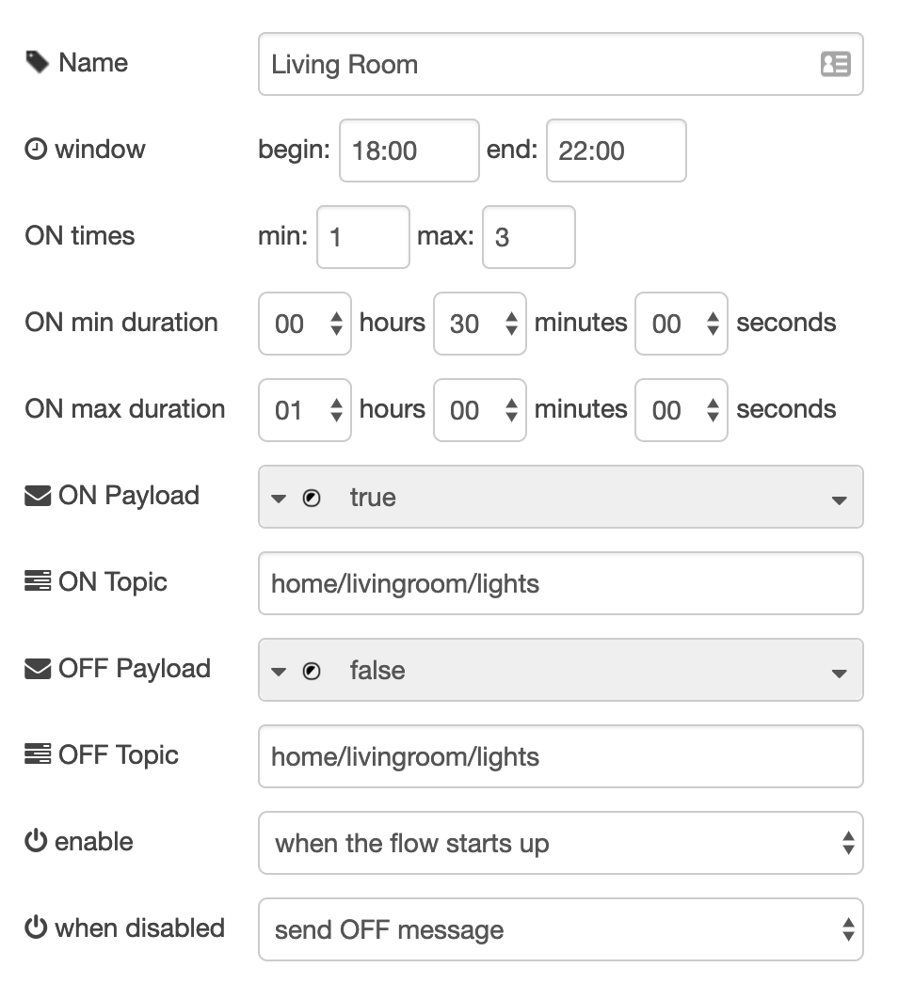

# Presence Faker

Node-RED node that can pretend that your home is occupied by switching devices (e.g. lights) on and off at random (configurable) times.

You can configure a time window during which the node should eject random ON / OFF messages (e.g. 07:00 - 14:30), the duration of ON times (min / max) as well as how many ON times (min / max) should be randomly scheduled.

## Example Flow


## Properties Configuration

Properties can be configured statically using the editor or dynamically by injecting a message with a config object.

### Static Configuration



### Dynamic Configuration

You can overwrite the static configuration at runtime by passing a config object as `msg.payload` to the presence-faker node. All attributes are optional. `minDuration` and `maxDuration` are expressed in seconds.

```
{
    "windowBegin": "00:00",
    "windowEnd": "23:59:59",
    "minDuration": 60,
    "maxDuration": 600,
    "minCount": 10,
    "maxCount": 25
}
```

If the presence-faker node is currently enabled, this will instantly create a new schedule with the new configuration being applied. Otherwise the changes will take effect as soon as the presence-faker node gets enabled.

## Contributions and Suggestions

... are always welcome! Just file a GitHub [issue](https://github.com/csuermann/presence-faker/issues) or [pull request](https://github.com/csuermann/presence-faker/pulls)!
